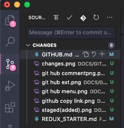
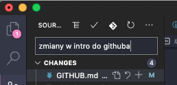
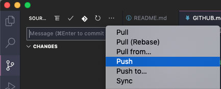

# GitHub Bardzo Podstawowy

GitHub to przyjaciel każdego programisty

Jeżeli o kodzie pomyślisz jak o książce to, Github będzie archiwum, w którym składujesz każdą wersję książki, od wczesnych szkiców do finalnej wersji

Bardziej technicznie: Github jest to narzędzie do kontroli wersji oprogramowania. Ułatwia pracę nad projektem samemu lub większym zespołom oraz pozwala na kontrolę kto aktualizuje kod na repozytorium

## Terminologia

**repozytorium** - miejsce przechowywania kodu, są repozotoria lokalne - u Ciebie na komputrze, oraz zdalne np na github.com

**push** - wprowadzenie zatwierdzonych zmian lokalnych do repozytorium zdalnego

**commit** - zatwierdzenie zmian lokalnych względem poprzedniej wersji

**pull** - porównanie z lokalną wersją i ściągnięcie aktualnej wersji z repozytorium

## Jak powiązać swój komputer z Twoim kontem Githuba
1. dodaj swojego usera `git config --global user.name "Przemocny"`
2. dodaj swojego emaila `git config --global user.email "mojmail@gmail.com"`
3. to wszystko

## Jak ściągnać repo z Githuba do siebie

#### przez terminal
`git clone https://github.com/Przemocny/zbior-zadan-html-css-js-react.git` polecenie używane do ściągnięcia repozytorium z githuba, polecenie można użyć w terminalu VSCODE

#### przez zipa
Klikasz przycisk `Download ZIP` i zapisujesz na dysku, tam gdzie chcesz pracować z kodem

## Jak wrzucić zmiany do repozytorium zdalnego

#### przez terminal
1. `git add .`  dodaje zmiany do commita (`.` oznacza, że dodaje wszystkie pliki podpięte do tego repozytorium)

2. `git commit -m "<komentarz>"` tworzy commit z wcześniej dodanymi zmianami (flaga `-m` jest obowiązkowa, jest to komentarz do commita)

3. `git push` wysyła wszystkie zaakceptowane zmiany w repozytorium lokalnym do repozytorium zdalnego

#### przez VSCODE

1. przejdź do wtyczki Gita do VSCODE

2. dodaj nazwę swojego commita, np "zmiany w intro do githuba"

1. klikamy "Commit" (ikonkę "check"), na środku nad inputem do wpisania
2. z menu otwieranego (ikonka ...) wybieramy opcję "Push"

5. i commit ląduje na repozytorium zdalnym

 
by :octocat: [Cosikowy](https://github.com/Cosikowy) i :octocat: [Przemocny](https://github.com/Przemocny)

Linki do dalszej poznawania Gita:
- Info od Githuba - https://github.github.com/training-kit/downloads/pl/github-git-cheat-sheet/
- Cheatsheet - https://github.github.com/training-kit/downloads/github-git-cheat-sheet.pdf

## W następnym odcinku - Github Bardziej Zaawansowany
