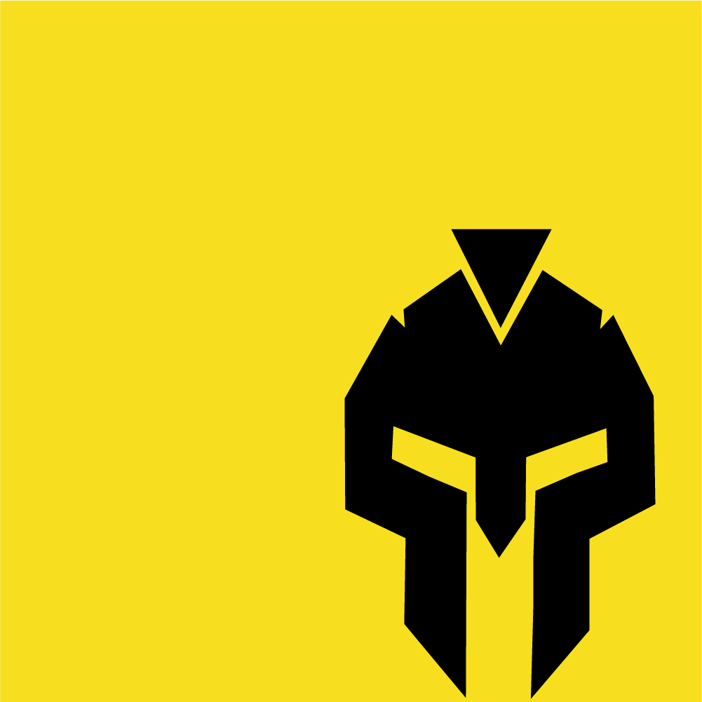

## i Ty możesz zostać Gladiatorem Javascriptu
#### Inicjatywa darmowego dzielenia się wiedzą

##### Repozytorium to:
### I. Zbiór zadań różnego poziomu (Newbie/Junior/Mid) z HTML, CSS, JS, TS, React, Redux, Node, Testów
### II. Darmowe materiały do nauki z HTML, CSS, JS, React, pisania testów
### III. Gotowy kod do implementacji bardziej zaawansowanych zagadnień z JS i React

Robocza stronka inicjatywy darmowego dzielenia się wiedzą: https://zbior-zadan-html-css-javascript-react.localhost-group.com/

# Zbiór na 2020 ma już 63/75 zadań
##### Zrobienie ich wszystkich zajmie Ci ok 250h lub więcej jeśli musisz się czegoś douczyć

## Na fanpage oraz różnych grupach frontendowych w każdy wtorek i piątek znajdziesz nowe, ciekawe zadania z HTML, CSS, Javascriput i Reacta

 

##### <i>Jako mentor, który trenuje specjalistów frontend mój główny cel to podniesienie poziomu znajomości Javascriptu oraz jego powszechnego obycia poprzez zadania praktyczne</i>

<i>Udostępniam i będę udostępniać aktualną wiedzę i standardy oraz materiały do ćwiczeń za darmo każdemu, kto chce się nauczyć jak być dobrym Frontend Developerem</i>

## DOCS
#### Uporządkowane materiały do nauki
- jeśli potrzebujesz abym coś dodał, napisz na fanpage, a dla dobra ogółu stanie się to kolejną wartością tego repozytorium

## FREE CODE
#### Uporządkowany kod gotowy do przeklejenia do siebie
- jeśli potrzebujesz abym coś dodał, napisz na fanpage, a dla dobra ogółu stanie się to kolejną wartością tego repozytorium

## ZADANIA
#### Dzielą się na 6 sekcji
- CSS + HTML - zadania związane z wyglądem aplikacji 
- JS + HTML - zadania związane z działaniem aplikacji
- JS - zadania związane z algorytmami, strukturami danych 
- TS - zadania związane z algorytmami, strukturami danych 
- REACT - zadania z Reacta, głównie budowanie komponentów i ich działania 
- TESTS - zadania, w których piszesz testy i ulepszasz istniejący kod

#### Dla szukających pomysłu na portfolio dodaliśmy też sekcję:
- INSPIRACJE DO PORTFOLIO - jeśli nie masz pomysłu na swoje portfolio, weź sobie projekt i staraj się zrealizowac - 1 projekt

#### Zadania są o różnym poziomie trudności dla programistów o różnym stopniu wtajemniczenia:
- Newbie - osoby po kursach Udemy, Samuraja, Youtubowych lub innych
- Junior - osoby ubiegające się o pierwsze stanowisko jako Frontend Developer
- Mid - osoby pracujące już jako Frontend Developerzy, ale chcące podnieść swoje umiejętności
##### jeśli dane zadanie jest dla Ciebie za trudne sprawdź kolejne, aż znajdziesz to, z którym dasz sobie radę

#### Wyślij swoje zadania na fanpage, a Twoje zadanie zostanie sprawdzone oraz dostaniesz informację zwrotną od doświadczonego mentora-rekrutera, co mógłbyś zrobić lepiej, a co jest mądrze zrobione

#### Punkty z trzema gwiazdkami *** są trudniejsze

##### Warunkiem sprawdzenia zadania jest:
- zrobione zadanie
- wstawienie komentarza do posta na naszym wallu z zadaniem linka do swojego publicznego repo na githubie/gitlabie/codesandbox w czasie krótszym niż 3 dni (masz czas do kolejnego zadania)
- ***napisanie przynajmniej 4 testów do danego zadania

## Podoba Ci się inicjatywa? - zostaw gwiazdkę w repo!!! z góry dzięki!!!

#### Dzięki gwiazdkom pomagasz dostarczyć darmową wiedzę do osób na początku swojej drogi w IT

### Chciałbyś dostawać więcej zadań, a może szukasz mentora na stałe? Utknąłeś w swoim rozwoju i nie wiesz co? A może zaplątałeś się w gąszczu nowej wiedzy?

#### Skontaktuj się na:
Fanpage: https://www.facebook.com/localhost40310
Stronka mojej akademii: https://academy.localhost-group.com/

Możesz łatwo pomóc udostępniając i lajkując posty, jeśli je zobaczysz lub kupując nasze zbiory zadań:

- <b>Gruntowny zestaw startowy</b> - HTML, zaawansowany CSS i podstawowy Javascript
- <b>Ambitny zestaw zaawansowany</b> - Zaawansowany Javascript, SCSS i React, Redux
- <b>Nieprzewidywalne i sprawiajace problemy testy</b> - Zaawansowany Javascript, React, Redux, Jest, Enzyme

Każdy zbiór to:
- Dożywotnia subskrybcja na repozytorium z ogromną ilością zadań
- Częste aktualizacje oparte o świeże materiały i standardy
- Zadania z życia i pracy Frontend Developera wzięte
- Pomysły na projekty wzbogacające Twoje portfolio
- Uporządkowane darmowe materiały do nauki

Cena wszystkich zbiorów: 220PLN
Cena dwóch zbiorów: 150PLN
Cena jednego zbioru: 100PLN

Opcja dla pracowitych prymusów:
<b>Zrób dobrze 5 naszych zadań z tego repo => masz gwarantowany rabat -30zł</b>

Masz pytania?
<b>Porozmawiajmy na fanpage :) </b>

