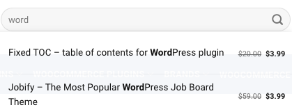

<h2 align="center">Password Input</h2>

<br>

## Wymagana wiedza

- React, HTML, CSS, JavaScript


## Technologie potrzebne do zadania

- React, HTML, CSS, JavaScript

## Cele główne
* [ ] Twoim zadaniem jest odtworzyć komponent wyszukiwania ze zdjęcia poniżej
* [ ] Zasady działania komponentu:
- komponent `SearchWithDropdown` ma posiadać input na wyszukiwaną frazę. Po wpisaniu frazy `word` pojawia się lista `DropdownList` która renderuje pojedyńcze zgodności z wyszukiwaną frazą jako komponenty `DropdownItem`
- Jeżeli długość podanej frazy jest krótsza, lub równa 3 znaki komponent `DropdownList` nie jest wyświetlany - fraza musi być większa lub równa niż 4 znaki.
- Komponent `DropdownList` zwraca "trafienia" w kolejności alfabetycznej, z wizualnym podkreśleniem wyszukiwanego słowa
- Wyszukiwanie ma nie być case sensitive, fraza `word` zostanie wyszukana również jako `Word`.
* [ ] Postaraj się odwzorować wygląd komponentu.
* [ ] Jako pozycje do wyszukiwania użyj danych `searchData` .

## Kawałek kodu dla lepszego początku!

```javascript
const searchData = [
    {
        name:"Fixed TOC - table of contents for WordPress plugin",
        regularPrice: 20,
        salePrice: 3.99
    },
    {
        name:"Jobify - The Most Popular WordpPress Job Board Theme".
        regularPrice: 59,
        salePrice: 3.99
    },
    {
        name:"Lorem ipsum".
        regularPrice: 99,
        salePrice: 21,
    }
]

const DropdownItem = ()=>{}
const DropdownList = ()=>{}
const SearchWithDropdown = ()=>{}
```




