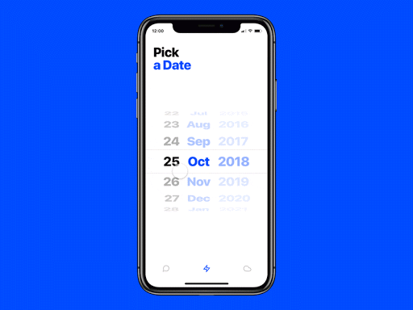

<h2 align="center">Date Picker</h2>

 

## Wymagana wiedza

- JavaScript, HTML, CSS

## Technologie potrzebne do zadania

- JavaScript, HTML, CSS

## Cele główne
* [ ] Twoim zadaniem jest odtworzyć wygląd i działanie datepickera zaprezentowanego w gifie poniżej.
* [ ] Date Picker powinien mieć możliwośc wyboru dnia, miesiąca, roku niezależnie od siebie.
* [ ] Postaraj się jak najbardziej szczegółowo odtworzyć wygląd pickera z gifa.
* [ ] Postaraj się uzyskać jak najwięcej mikrointerakcji np. zwiększenie rozmiaru/koloru aktualnie wybranej pozycji podczas kliknięcia.

