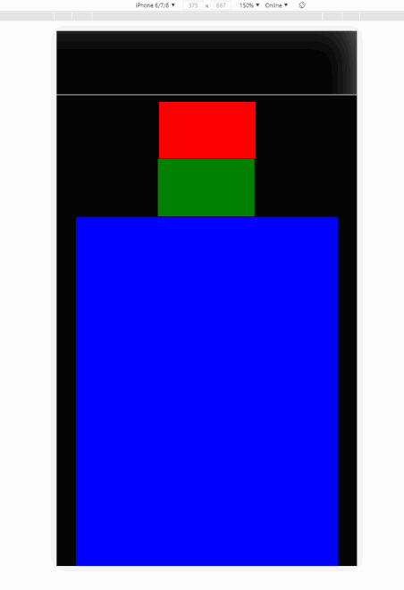

<h2 align="center">Smart Logo</h2>

 

## Wymagana wiedza

- JavaScript, HTML, CSS

## Technologie potrzebne do zadania

- JavaScript, HTML, CSS

## Cele główne
* [ ] Twoim zadaniem jest stworzyć scrollowalny element o klasie `.post` , w którym są umieszczone 3 elementy. Na podstawie poniższego gifa załóżmy że:
- element o kolorze niebieskim to główna część np. tekst na stronie postu, nadaj mu klasę `.post__content`,
- element o kolorze zielonym to logo, nadaj mu klasę `.post__logo`
- element o kolorze czerwonym to informacje o autorze,`.__post__author`
- informacje o poscie, autorze, logu są jedynie dla lepszego zobrazowania problemu

* [ ] Element post umieszczony jest w elemencie `.body` w którym występuje `navbar` właściwościach:
- wysokość 100px,
- szerokość 100%,
- przezroczystość 100%,
- granica dolna 1px szara,

* [ ] Zasada działania:
- jeśli użytkownik przescrolluje element o klasie `.post` ppowyżej niż wysokośc navbara liczona od góry, wtedy element o klasie `.post__logo` zostaje "przeniesiony" do navbara, zmieniajac swój rozmiar o połowę, i umieszczany jest w pozycji absolute tak jak w gifie.
- równocześnie do powyższego zachowania, navbar przestaje być przezroczysty i staje się półprzeźroczysty
- po ponownym przescrollowaniu poniżej wysokości navbara, układ wraca do pozycji domyślnej

* [ ] W zadaniu wykorzystaj metodologię BEM

